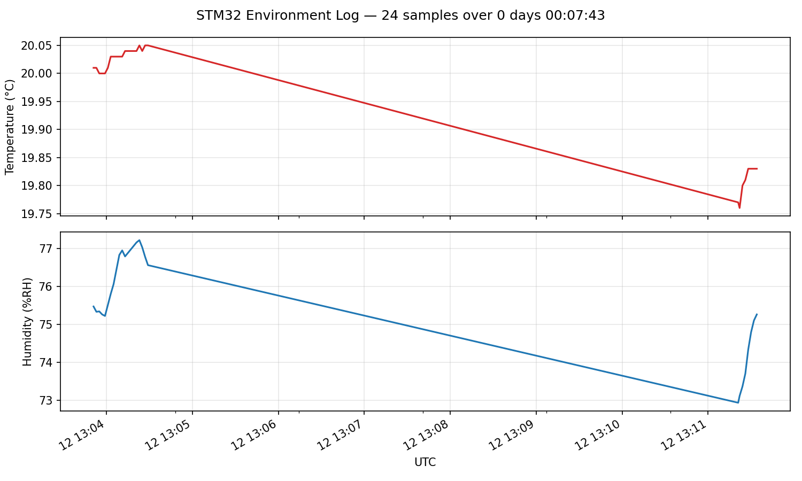

# STM32 Environment Logger

A bare-metal firmware for the **STM32L476RG Nucleo** that reads temperature and humidity from an **SHT31** sensor over I²C and streams the data over USB serial. A companion Python script on the host records the stream to a timestamped CSV.

No HAL. No CubeMX. No Arduino. Every peripheral configured from the reference manual, register by register.


## What it does

- Boots from a hand-written linker script and startup file.
- Configures GPIO, USART2, I²C1, and TIM2 by writing directly to peripheral registers.
- Samples the SHT31 every 2 seconds, driven by a TIM2 interrupt.
- CRC-validates every measurement against the SHT31's transmitted checksums.
- Streams `Temp: 23.47 C, Humidity: 55.21 %RH` over USB serial at 115200 baud.
- Logs to CSV on the host with UTC timestamps for later analysis.


*[N] hours of environmental data captured on [date]. Visible diurnal cycle as the room cooled overnight.*

## Hardware

| Component | Notes |
|-----------|-------|
| NUCLEO-L476RG | STM32L476RG Cortex-M4F, built-in ST-LINK/V2-1 |
| Adafruit SHT31-D breakout | I²C address 0x44, on-board 10 kΩ pull-ups |
| 4× M-M jumper wires | |
| Half-size breadboard | |

### Wiring
Nucleo-L476RG          SHT31
──────────
3V3       (CN6)  ───── VIN
GND       (CN6)  ───── GND
SCL/D15   (CN5)  ───── SCL   (PB8, I²C1_SCL, AF4)
SDA/D14   (CN5)  ───── SDA   (PB9, I²C1_SDA, AF4)

## Build & flash

Requires `arm-none-eabi-gcc` (15.2 or newer) and OpenOCD (0.12 or newer). On macOS:

```bash
brew install --cask gcc-arm-embedded
brew install openocd
```

Then from the repo root:

```bash
make            # produces build/firmware.elf
make flash      # OpenOCD programs the chip via ST-LINK
```

## Run the logger

```bash
cd scripts
python3 -m venv venv && source venv/bin/activate
pip install -r requirements.txt
python logger.py            # auto-detects /dev/cu.usbmodem*
```

Append-mode CSV at `scripts/readings.csv`. Ctrl-C to stop.

## Implementation notes

A few design decisions that are non-obvious from the code alone:

- **No HAL, by design.** Every peripheral configuration write is verifiable line-by-line against RM0351. This made debugging tractable; HAL would have hidden where the bug actually lived.
- **STM32L4 I²C is CR2-driven**, not the F1/F4 step-by-step protocol. The whole transaction (address, direction, byte count, auto-STOP) is configured in CR2, then the START bit launches it.
- **Fixed-point integer formatting** instead of `printf("%f", ...)`. Float-printf via newlib costs ~6 KB of flash and obscures what's happening. `value_x100 / 100` and `value_x100 % 100` is two divides and zero library code.
- **CRC verification is non-optional.** SHT31 transmits a CRC-8 with every 2-byte measurement word. Skipping the check means occasional bit flips on marginal pull-ups silently corrupt the CSV.
- **Timer interrupt + main-loop flag**, not blocking delays. Costs one volatile byte of RAM and gives precise 2 s cadence regardless of how long `sht31_read()` actually takes.

## What I'd add next

- DMA for the I²C read so the CPU doesn't busy-wait during the 200 µs+ transfer.
- A low-power sleep (`__WFI()`) between samples — current draw should drop from ~3 mA to under 100 µA.
- Onboard SD-card logging via SPI so the host script isn't required.
- A second temperature sensor (DS18B20 over 1-Wire) for cross-validation.

## License

MIT. See [LICENSE](LICENSE).
